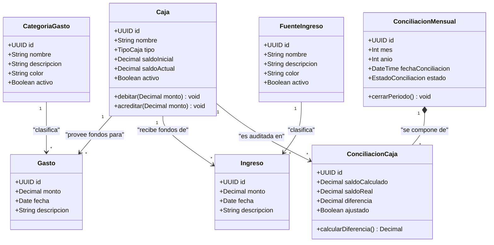

Título: Modelo de Dominio
Autor: Antigravity (IA Analyst)
Fecha de Última Actualización: Miércoles, 20 de mayo de 2026
Versión: 0.1.0

# Modelo de Dominio: CashFlow Personal Analyzer (CPA)

Este documento define las entidades conceptuales, sus atributos clave, comportamientos y relaciones dentro del dominio financiero de la aplicación. El objetivo es consolidar un lenguaje común y sentar las bases conceptuales para el posterior desarrollo del software y el diseño físico de la base de datos.

---

## 1. Glosario Conceptual del Dominio
* **Caja (Cuenta/Monedero):** Representación abstracta de cualquier depósito, cuenta bancaria o tenencia física de dinero de la cual Alejandro dispone para realizar transacciones.
* **Gasto (Egreso):** Una salida transaccional de dinero que se debita de una caja específica y que se clasifica bajo una categoría particular.
* **Ingreso:** Una entrada transaccional de dinero que se acredita a una caja específica y que se clasifica bajo una fuente de origen.
* **Categoría de Gasto:** Clasificación conceptual y dinámica de los egresos (ej. Comida, Alquiler, Transporte) que permite agrupar y analizar los hábitos de consumo.
* **Fuente de Ingreso:** Clasificación conceptual y dinámica de las entradas (ej. Sueldo, Freelance, Dividendos) que identifica el origen de los recursos.
* **Conciliación Mensual:** El proceso periódico de auditoría al término de un mes calendario, donde se comparan los saldos lógicos del sistema contra los montos físicos reales de cada caja.

---

## 2. Diagrama de Clases del Dominio (Mermaid.js)

---

## 3. Especificación Detallada de Entidades

### 3.1. Entidad: `Caja`
* **Responsabilidad:** Administrar la disponibilidad inmediata de dinero, registrar su saldo actual y procesar débitos y créditos transaccionales.
* **Atributos:**
  * `id` (UUID): Identificador único del sistema.
  * `nombre` (Texto): Nombre descriptivo (ej. "Banco Santa Fe", "Efectivo Caja Fuerte", "Tarjeta Débito Galicia"). Debe ser único.
  * `tipo` (Enum): `BANCO`, `EFECTIVO`, `TARJETA_DEBITO`, `OTRO`.
  * `saldoInicial` (Decimal): Monto inicial con el que se crea la caja. Fijo tras su registro.
  * `saldoActual` (Decimal): Monto calculado en tiempo real.
  * `activo` (Boolean): Indica si la caja se encuentra habilitada para nuevas transacciones.
* **Comportamientos Clave:**
  * `debitar(monto)`: Reduce el `saldoActual` en la cantidad especificada.
  * `acreditar(monto)`: Incrementa el `saldoActual` en la cantidad especificada.

### 3.2. Entidad: `Gasto`
* **Responsabilidad:** Almacenar la información detallada de una salida de fondos individual.
* **Atributos:**
  * `id` (UUID): Identificador único.
  * `monto` (Decimal): Valor monetario del egreso. Debe ser mayor a cero.
  * `fecha` (Date): Fecha del calendario en la que se incurrió en el gasto.
  * `descripcion` (Texto, Opcional): Información contextual aclaratoria.
* **Relaciones:**
  * Vinculado obligatoriamente a una (1) `Caja` (de donde se retiran los fondos).
  * Vinculado obligatoriamente a una (1) `CategoriaGasto` (motivo de clasificación).

### 3.3. Entidad: `Ingreso`
* **Responsabilidad:** Almacenar la información detallada de una entrada de fondos individual.
* **Atributos:**
  * `id` (UUID): Identificador único.
  * `monto` (Decimal): Valor monetario del ingreso. Debe ser mayor a cero.
  * `fecha` (Date): Fecha del calendario en la que se percibió el dinero.
  * `descripcion` (Texto, Opcional): Detalles aclaratorios.
* **Relaciones:**
  * Vinculado obligatoriamente a una (1) `Caja` (donde se depositan los fondos).
  * Vinculado obligatoriamente a una (1) `FuenteIngreso` (origen del capital).

### 3.4. Entidad: `CategoriaGasto` y `FuenteIngreso` (Catálogos Dinámicos)
* **Responsabilidad:** Permitir la clasificación dinámica e independiente de egresos e ingresos respectivamente.
* **Atributos:**
  * `id` (UUID): Identificador único.
  * `nombre` (Texto): Nombre representativo (ej. "Alimentación", "Sueldo Alejandro"). Debe ser único en su respectivo catálogo.
  * `descripcion` (Texto, Opcional): Nota aclaratoria del tipo de transacciones que comprende.
  * `color` (Texto Hexadecimal): Código de color para renderización gráfica (ej. `#FF5733`).
  * `activo` (Boolean): Permite archivar el catálogo sin destruir registros históricos.

### 3.5. Entidad: `ConciliacionMensual`
* **Responsabilidad:** Encabezado que define el período mensual calendario consolidado sometido a auditoría.
* **Atributos:**
  * `id` (UUID): Identificador único.
  * `mes` (Entero: 1 al 12): Mes calendario a auditar.
  * `anio` (Entero): Año de cuatro dígitos.
  * `fechaConciliacion` (Fecha y Hora): Instante en que se generó la auditoría.
  * `estado` (Enum): `ABIERTO`, `CONCILIADO_CON_AJUSTES`, `CERRADO_SIN_DISCREPANCIAS`.

### 3.6. Entidad Relacionada: `ConciliacionCaja` (Detalle de Auditoría)
* **Responsabilidad:** Almacenar el resultado de comparar el saldo calculado matemáticamente por el sistema contra la declaración de fondos reales de una caja al fin de mes.
* **Atributos:**
  * `id` (UUID): Identificador único.
  * `saldoCalculado` (Decimal): Saldo histórico registrado por el sistema para esa caja al día final del mes.
  * `saldoReal` (Decimal): Saldo físico/bancario real contado y cargado por el usuario.
  * `diferencia` (Decimal): Calculado como `saldoReal - saldoCalculado`.
  * `ajustado` (Boolean): Indica si se aplicó un movimiento de balance automático para saldar la caja.

---

## 4. Reglas de Negocio del Dominio (Invariantes)

1. **Invariante de Saldo en Transacción:** Un `Gasto` no puede existir sin estar asociado a una `Caja` de origen. Un `Ingreso` no puede existir sin estar asociado a una `Caja` de destino.
2. **Consistencia de Caja:** El saldo actual de cualquier `Caja` en cualquier momento del tiempo se calcula matemáticamente como:
   $$\text{Saldo Actual} = \text{Saldo Inicial} + \sum \text{Monto Ingresos} - \sum \text{Monto Gastos}$$
3. **Cierre de Período Bloqueado:** Una vez que el estado de una `ConciliacionMensual` cambia a `CERRADO` o `CONCILIADO`, todas las transacciones (`Gasto`, `Ingreso`) cuya fecha pertenezca a ese mes y año calendario quedarán en estado **Read-Only** (sólo lectura) para resguardar la integridad de auditorías anteriores.
4. **Auto-Ajuste de Conciliación:** Si en una auditoría mensual `diferencia != 0`:
   * Si `diferencia > 0` (sobrante): Se crea automáticamente un `Ingreso` asociado a la caja correspondiente con la categoría especial de sistema "Ajuste por Conciliación".
   * Si `diferencia < 0` (faltante): Se crea un `Gasto` con la categoría especial "Ajuste por Conciliación".

---

| Versión | Fecha de Revisión | Autor | Revisor | Cambios Realizados |
| :--- | :--- | :--- | :--- | :--- |
| 0.1.0 | 20-05-2026 | Antigravity | Alejandro | Creación inicial del documento. |
