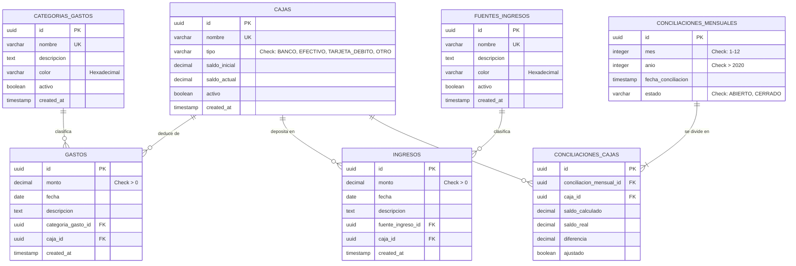

Título: Diagrama de Base de Datos y Esquema Físico
Autor: Antigravity (IA Analyst)
Fecha de Última Actualización: Miércoles, 20 de mayo de 2026
Versión: 0.1.0

# Esquema Físico de Base de Datos: CashFlow Personal Analyzer (CPA)

Este documento define la arquitectura física y el esquema relacional de base de datos para la aplicación CPA. Se ha diseñado optimizando la integridad referencial de las transacciones financieras y la velocidad de consulta en reportes analíticos (MoM %, tops, promedios) utilizando **PostgreSQL** como motor de referencia estándar.

---

## 1. Diagrama Entidad-Relación (DER en Mermaid.js)



---

## 2. Diccionario de Datos y Especificaciones de Tablas

### 2.1. Tabla: `cajas`
Almacena las cuentas de dinero de Alejandro.
| Columna | Tipo de Datos | Restricciones | Descripción |
| :--- | :--- | :--- | :--- |
| `id` | `UUID` | `PRIMARY KEY`, `DEFAULT gen_random_uuid()` | Identificador de cuenta. |
| `nombre` | `VARCHAR(100)` | `NOT NULL`, `UNIQUE` | Nombre único (ej. "Banco Santa Fe"). |
| `tipo` | `VARCHAR(30)` | `NOT NULL`, `CHECK (tipo IN ('BANCO', 'EFECTIVO', 'TARJETA_DEBITO', 'OTRO'))` | Clasificación de cuenta. |
| `saldo_inicial` | `DECIMAL(12,2)` | `NOT NULL`, `DEFAULT 0.00` | Saldo cargado en la creación inicial. |
| `saldo_actual` | `DECIMAL(12,2)` | `NOT NULL`, `DEFAULT 0.00` | Saldo en tiempo real (mantenido por triggers/lógica). |
| `activo` | `BOOLEAN` | `NOT NULL`, `DEFAULT TRUE` | Para inactivar y archivar la caja. |
| `created_at` | `TIMESTAMP` | `DEFAULT CURRENT_TIMESTAMP` | Fecha de creación del registro. |

### 2.2. Tabla: `categorias_gastos`
Catálogo dinámico de categorías de costos.
| Columna | Tipo de Datos | Restricciones | Descripción |
| :--- | :--- | :--- | :--- |
| `id` | `UUID` | `PRIMARY KEY`, `DEFAULT gen_random_uuid()` | Identificador de categoría. |
| `nombre` | `VARCHAR(100)` | `NOT NULL`, `UNIQUE` | Ej. "Supermercado", "Servicios". |
| `descripcion` | `TEXT` | `NULL` | Detalle conceptual opcional. |
| `color` | `VARCHAR(7)` | `NOT NULL`, `DEFAULT '#CCCCCC'` | Código color Hex (CSS render). |
| `activo` | `BOOLEAN` | `NOT NULL`, `DEFAULT TRUE` | Baja lógica. |

### 2.3. Tabla: `fuentes_ingresos`
Catálogo dinámico de fuentes de ingresos.
| Columna | Tipo de Datos | Restricciones | Descripción |
| :--- | :--- | :--- | :--- |
| `id` | `UUID` | `PRIMARY KEY`, `DEFAULT gen_random_uuid()` | Identificador de fuente. |
| `nombre` | `VARCHAR(100)` | `NOT NULL`, `UNIQUE` | Ej. "Sueldo Blanco", "Freelance". |
| `descripcion` | `TEXT` | `NULL` | Detalle conceptual opcional. |
| `color` | `VARCHAR(7)` | `NOT NULL`, `DEFAULT '#CCCCCC'` | Código color Hex. |
| `activo` | `BOOLEAN` | `NOT NULL`, `DEFAULT TRUE` | Baja lógica. |

### 2.4. Tabla: `gastos` (Historial detallado)
Historial transaccional de egresos de dinero.
| Columna | Tipo de Datos | Restricciones | Descripción |
| :--- | :--- | :--- | :--- |
| `id` | `UUID` | `PRIMARY KEY`, `DEFAULT gen_random_uuid()` | Identificador del gasto. |
| `monto` | `DECIMAL(12,2)` | `NOT NULL`, `CHECK (monto > 0.00)` | Monto monetario. |
| `fecha` | `DATE` | `NOT NULL` | Fecha de realización. |
| `descripcion` | `TEXT` | `NULL` | Nota del gasto. |
| `categoria_gasto_id` | `UUID` | `NOT NULL`, `REFERENCES categorias_gastos(id) ON DELETE RESTRICT` | Categoría vinculada. |
| `caja_id` | `UUID` | `NOT NULL`, `REFERENCES cajas(id) ON DELETE RESTRICT` | Caja de origen del dinero. |

### 2.5. Tabla: `ingresos` (Historial detallado)
Historial transaccional de ingresos de dinero.
| Columna | Tipo de Datos | Restricciones | Descripción |
| :--- | :--- | :--- | :--- |
| `id` | `UUID` | `PRIMARY KEY`, `DEFAULT gen_random_uuid()` | Identificador del ingreso. |
| `monto` | `DECIMAL(12,2)` | `NOT NULL`, `CHECK (monto > 0.00)` | Monto ingresado. |
| `fecha` | `DATE` | `NOT NULL` | Fecha de depósito. |
| `descripcion` | `TEXT` | `NULL` | Nota. |
| `fuente_ingreso_id`| `UUID` | `NOT NULL`, `REFERENCES fuentes_ingresos(id) ON DELETE RESTRICT` | Fuente de origen. |
| `caja_id` | `UUID` | `NOT NULL`, `REFERENCES cajas(id) ON DELETE RESTRICT` | Caja de destino donde entra. |

### 2.6. Tabla: `conciliaciones_mensuales`
Define los períodos de auditoría de cajas por mes calendario.
| Columna | Tipo de Datos | Restricciones | Descripción |
| :--- | :--- | :--- | :--- |
| `id` | `UUID` | `PRIMARY KEY`, `DEFAULT gen_random_uuid()` | Identificador. |
| `mes` | `INTEGER` | `NOT NULL`, `CHECK (mes BETWEEN 1 AND 12)` | Mes de control. |
| `anio` | `INTEGER` | `NOT NULL`, `CHECK (anio >= 2020)` | Año del período. |
| `fecha_conciliacion`| `TIMESTAMP` | `DEFAULT CURRENT_TIMESTAMP` | Instante de la auditoría. |
| `estado` | `VARCHAR(30)` | `NOT NULL`, `CHECK (estado IN ('ABIERTO', 'CERRADO'))` | Estado de edición del mes. |
| **Restricción Única**| `UNIQUE(mes, anio)` | Evita duplicar conciliaciones en el mismo mes calendario. |

### 2.7. Tabla: `conciliaciones_cajas`
Detalle del estado de auditoría de cada caja individual para un mes específico.
| Columna | Tipo de Datos | Restricciones | Descripción |
| :--- | :--- | :--- | :--- |
| `id` | `UUID` | `PRIMARY KEY`, `DEFAULT gen_random_uuid()` | Identificador. |
| `conciliacion_mensual_id`| `UUID` | `NOT NULL`, `REFERENCES conciliaciones_mensuales(id) ON DELETE CASCADE` | Encabezado mensual. |
| `caja_id` | `UUID` | `NOT NULL`, `REFERENCES cajas(id) ON DELETE RESTRICT` | Caja auditada. |
| `saldo_calculado` | `DECIMAL(12,2)` | `NOT NULL` | Saldo que tiene el sistema. |
| `saldo_real` | `DECIMAL(12,2)` | `NOT NULL` | Saldo físico real. |
| `diferencia` | `DECIMAL(12,2)` | `NOT NULL` | `saldo_real - saldo_calculado`. |
| `ajustado` | `BOOLEAN` | `NOT NULL`, `DEFAULT FALSE` | `TRUE` si se generó transacción de ajuste. |
| **Restricción Única**| `UNIQUE(conciliacion_mensual_id, caja_id)` | Una caja se audita sólo una vez por mes. |

---

## 3. Sentencias de Creación DDL (PostgreSQL)

```sql
-- Habilitar extensión para UUIDs
CREATE EXTENSION IF NOT EXISTS "uuid-ossp";

-- 1. TABLA CAJAS
CREATE TABLE cajas (
    id UUID PRIMARY KEY DEFAULT uuid_generate_v4(),
    nombre VARCHAR(100) UNIQUE NOT NULL,
    tipo VARCHAR(30) NOT NULL CHECK (tipo IN ('BANCO', 'EFECTIVO', 'TARJETA_DEBITO', 'OTRO')),
    saldo_inicial DECIMAL(12, 2) NOT NULL DEFAULT 0.00,
    saldo_actual DECIMAL(12, 2) NOT NULL DEFAULT 0.00,
    activo BOOLEAN NOT NULL DEFAULT TRUE,
    created_at TIMESTAMP NOT NULL DEFAULT CURRENT_TIMESTAMP,
    updated_at TIMESTAMP NOT NULL DEFAULT CURRENT_TIMESTAMP
);

-- 2. TABLA CATEGORIAS GASTOS
CREATE TABLE categorias_gastos (
    id UUID PRIMARY KEY DEFAULT uuid_generate_v4(),
    nombre VARCHAR(100) UNIQUE NOT NULL,
    descripcion TEXT,
    color VARCHAR(7) NOT NULL DEFAULT '#CCCCCC',
    activo BOOLEAN NOT NULL DEFAULT TRUE,
    created_at TIMESTAMP NOT NULL DEFAULT CURRENT_TIMESTAMP
);

-- 3. TABLA FUENTES INGRESOS
CREATE TABLE fuentes_ingresos (
    id UUID PRIMARY KEY DEFAULT uuid_generate_v4(),
    nombre VARCHAR(100) UNIQUE NOT NULL,
    descripcion TEXT,
    color VARCHAR(7) NOT NULL DEFAULT '#CCCCCC',
    activo BOOLEAN NOT NULL DEFAULT TRUE,
    created_at TIMESTAMP NOT NULL DEFAULT CURRENT_TIMESTAMP
);

-- 4. TABLA GASTOS
CREATE TABLE gastos (
    id UUID PRIMARY KEY DEFAULT uuid_generate_v4(),
    monto DECIMAL(12, 2) NOT NULL CHECK (monto > 0.00),
    fecha DATE NOT NULL,
    descripcion TEXT,
    categoria_gasto_id UUID NOT NULL REFERENCES categorias_gastos(id) ON DELETE RESTRICT,
    caja_id UUID NOT NULL REFERENCES cajas(id) ON DELETE RESTRICT,
    created_at TIMESTAMP NOT NULL DEFAULT CURRENT_TIMESTAMP
);

-- 5. TABLA INGRESOS
CREATE TABLE ingresos (
    id UUID PRIMARY KEY DEFAULT uuid_generate_v4(),
    monto DECIMAL(12, 2) NOT NULL CHECK (monto > 0.00),
    fecha DATE NOT NULL,
    descripcion TEXT,
    fuente_ingreso_id UUID NOT NULL REFERENCES fuentes_ingresos(id) ON DELETE RESTRICT,
    caja_id UUID NOT NULL REFERENCES cajas(id) ON DELETE RESTRICT,
    created_at TIMESTAMP NOT NULL DEFAULT CURRENT_TIMESTAMP
);

-- 6. TABLA CONCILIACIONES MENSUALES
CREATE TABLE conciliaciones_mensuales (
    id UUID PRIMARY KEY DEFAULT uuid_generate_v4(),
    mes INTEGER NOT NULL CHECK (mes BETWEEN 1 AND 12),
    anio INTEGER NOT NULL CHECK (anio >= 2020),
    fecha_conciliacion TIMESTAMP NOT NULL DEFAULT CURRENT_TIMESTAMP,
    estado VARCHAR(30) NOT NULL DEFAULT 'ABIERTO' CHECK (estado IN ('ABIERTO', 'CERRADO')),
    CONSTRAINT unique_mes_anio UNIQUE (mes, anio)
);

-- 7. TABLA DETALLE CONCILIACION CAJA
CREATE TABLE conciliaciones_cajas (
    id UUID PRIMARY KEY DEFAULT uuid_generate_v4(),
    conciliacion_mensual_id UUID NOT NULL REFERENCES conciliaciones_mensuales(id) ON DELETE CASCADE,
    caja_id UUID NOT NULL REFERENCES cajas(id) ON DELETE RESTRICT,
    saldo_calculado DECIMAL(12, 2) NOT NULL,
    saldo_real DECIMAL(12, 2) NOT NULL,
    diferencia DECIMAL(12, 2) NOT NULL,
    ajustado BOOLEAN NOT NULL DEFAULT FALSE,
    CONSTRAINT unique_conciliacion_caja UNIQUE (conciliacion_mensual_id, caja_id)
);
```

---

## 4. Índices de Base de Datos para Alto Rendimiento (Query Tuning)

Para garantizar la agilidad analítica del Dashboard y del cálculo del Month-over-Month (MoM %) por categorías en bases de datos con miles de transacciones acumuladas por Alejandro, se definen los siguientes índices físicos:

```sql
-- Índices para mejorar las consultas agregadas por fecha (Dashboard / MoM)
CREATE INDEX idx_gastos_fecha ON gastos(fecha);
CREATE INDEX idx_ingresos_fecha ON ingresos(fecha);

-- Índices de llaves foráneas para optimizar JOINS y evitar Table Scans
CREATE INDEX idx_gastos_caja ON gastos(caja_id);
CREATE INDEX idx_gastos_categoria ON gastos(categoria_gasto_id);
CREATE INDEX idx_ingresos_caja ON ingresos(caja_id);
CREATE INDEX idx_ingresos_fuente ON ingresos(fuente_ingreso_id);

-- Índice compuesto para auditorías de conciliación
CREATE INDEX idx_conciliacion_cajas_mensual ON conciliaciones_cajas(conciliacion_mensual_id, caja_id);
```

---

| Versión | Fecha de Revisión | Autor | Revisor | Cambios Realizados |
| :--- | :--- | :--- | :--- | :--- |
| 0.1.0 | 20-05-2026 | Antigravity | Alejandro | Creación inicial del documento. |
